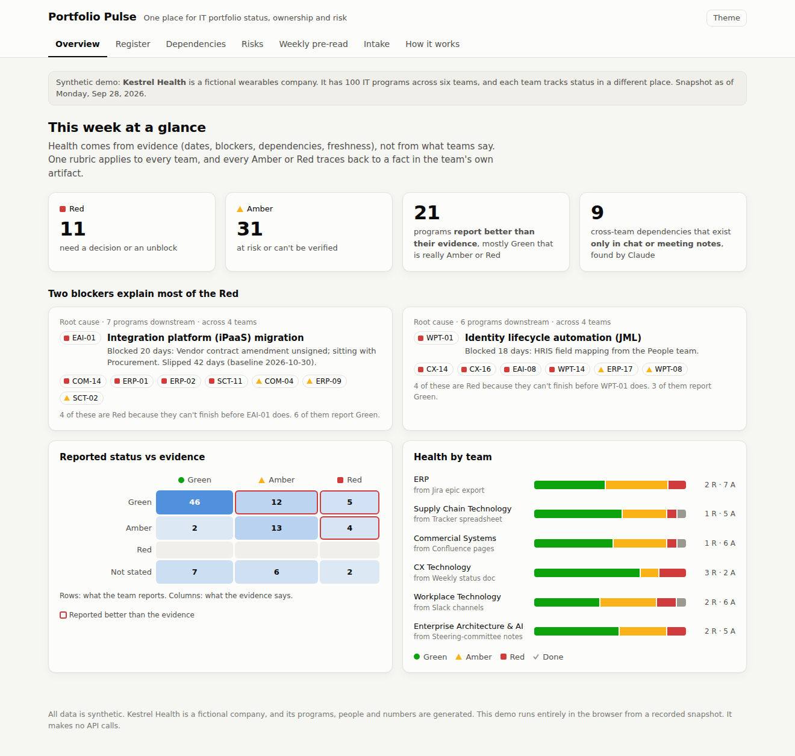

# Portfolio Pulse

**An AI-first system of record for an IT portfolio.** It turns six teams' messy working artifacts into one trusted register, with a shared definition of health, receipts for every field, cross-team dependency risk, a verified weekly pre-read, and one-week intake triage.

**[Live demo →](https://acalderon3.github.io/portfolio-pulse/)** It's a static page with no login and no API key, and it costs nothing to view.



> All data is synthetic. *Kestrel Health* is a fictional wearables company with 100 IT programs across six teams (ERP, Supply Chain Tech, Commercial Systems, CX Tech, Workplace Tech, and Enterprise Architecture & AI). Every person, program and number is generated.

## The problem it models

About 100 concurrent programs, six teams, and six versions of the truth. ERP lives in Jira, supply chain in a spreadsheet, Commercial in Confluence, CX in a weekly doc, Workplace in Slack, and Enterprise Architecture in steering-committee notes. Nobody can say what's happening this week, who owns what, or what needs a decision before it turns into a fire.

## What it does

| Need | How Portfolio Pulse handles it |
|---|---|
| One system of record, without a new reporting burden | Reads each team's **existing** artifact as-is. There are no forms and nothing to fill in. |
| Shared, trusted definitions of health | One evidence-based rubric ([`pipeline/rubric.py`](pipeline/rubric.py)) scores every team: aging blockers, slips, stale updates, freeze collisions, and dependencies that will land late. Every Amber or Red cites the fact behind it. |
| Owner, status, date, blocker, and why it matters for every program | Every field links to its receipt: the file, row or message, and the exact text. |
| Surface quiet cross-team coupling | Claude reads chat and meeting notes and finds dependencies that exist nowhere in a tracker. In the sample, 9 cross-team links are like that. One unsigned vendor contract turns out to put the ERP go-live and 6 other programs at risk. |
| A decision-forcing weekly review | A one-page pre-read that leads with decisions (who, by when, the consequence of doing nothing). Claude drafts it, a script checks it against the data, and a person edits it. |
| New requests answered within a week | Intake triage checks platform readiness, freezes, team load and trade-off candidates, then drafts the yes / yes-if / not-by answer. |
| Use AI with judgment, and verify it before it ships | See below. This is the point of the project. |

## How AI is used, and where it isn't

```
six sources ─┬─ structured (Jira, sheet, Confluence, status doc) ── plain parsers ─────────────┐
             └─ unstructured (Slack, meeting notes) ── Claude extraction ── grounding check ───┤
                                                                                                ├─ register ── rubric ── dependency analysis ── snapshot
                                                  Claude drafts pre-read ── checker ── human ───┘
```

- **Code does what is deterministic.** Four of the six sources have fields, so they're parsed without a model. A model there would add cost and nondeterminism and nothing else.
- **Claude does what needs a reader.** It resolves nicknames ("JML", "the ERP go-live") to catalog IDs, pulls dates and blockers out of chat, and spots statements like *"the ERP go-live can't happen before the iPaaS cutover"* ([prompt](prompts/extract_unstructured.md)).
- **Every model output is checked mechanically.** Each extracted value must come with a verbatim quote that exists in the source. Dates must appear in their quote, and a last-update date must match the quoted message's timestamp. Anything that fails is dropped and logged ([`pipeline/extract.py`](pipeline/extract.py), [tests](tests/test_pipeline.py)).
- **The rubric scores, not the model.** Health has to be identical across teams and explainable in a sentence.
- **A person makes the calls.** That covers the final health call, escalations, trade-offs, and anything political.

### Verification, with receipts

The generator knows the real facts behind every messy artifact, so [`pipeline/eval.py`](pipeline/eval.py) scores the pipeline field by field. [`pipeline/verify_preread.py`](pipeline/verify_preread.py) checks every ID, health tag, headline count and hygiene list in the pre-read against the data. The [verification log](docs/data/verification_log.md) records the real catches from building this:

1. The eval caught a **parser** bug (not a model bug) that made three healthy programs look stale.
2. The eval caught an error in the answer key itself.
3. The checker caught stale headline counts in Claude's pre-read draft.
4. A human read caught what no script could: a miscounted "four teams", and a deadline the model had invented inside a recommendation.

*Honest caveat:* templated synthetic text is easier than real chat, so the 100% scores show that the checks work. They are not a claim about real-world accuracy.

## Why the demo costs nothing

The site in [`docs/`](docs) is plain HTML and JS reading a committed snapshot. Model output is **recorded** in [`pipeline/cache/`](pipeline/cache) and replayed. Each recording is pinned to hashes of its prompt and source files, and the build warns if either one changes. The cached extraction was produced by Claude running the repo's extraction prompt on the exact input the script sends. To re-record it through the API:

```bash
pip install anthropic && export ANTHROPIC_API_KEY=...
make live          # re-runs extraction, rebuilds, re-scores, re-verifies
```

## Run it locally

```bash
make all           # build snapshot, score vs ground truth, verify pre-read, run tests (stdlib only; tests need pytest)
make serve         # http://localhost:8000
make data          # regenerate the synthetic sources (deterministic)
```

CI ([`.github/workflows/check.yml`](.github/workflows/check.yml)) runs all of this on every push.

## Deploy the demo (GitHub Pages)

Push the repo, then go to **Settings → Pages → Deploy from a branch → `main` / `/docs`**. The site's links to the source files turn on automatically once it's served from `github.io`.

## Repo map

```
generator/   synthetic company, programs, planted risks, six messy source formats
sources/     the generated artifacts (what each team "actually maintains")
ground_truth/ real facts, read only by eval.py
pipeline/    adapters (parsers) · extract (Claude + grounding) · rubric · build · eval · verify_preread
prompts/     extraction, weekly pre-read, intake triage
docs/        the static demo site + data snapshot (GitHub Pages root)
tests/       grounding and rubric tests
```

## What I'd do in the first 90 days with real data

1. **Weeks 1–3:** Agree on the rubric with the six leads before building anything. The definition is the product. Seed the catalog. Connect read-only to Jira and Confluence exports.
2. **Weeks 4–8:** Run the pre-read in parallel with the current process, and track every disagreement between the rubric and the team as a calibration item. Add week-over-week deltas.
3. **Weeks 9–12:** Make the review decision-forcing: an open-decisions log with owners and dates, carried over until closed. Turn on intake triage with its one-week answer.
